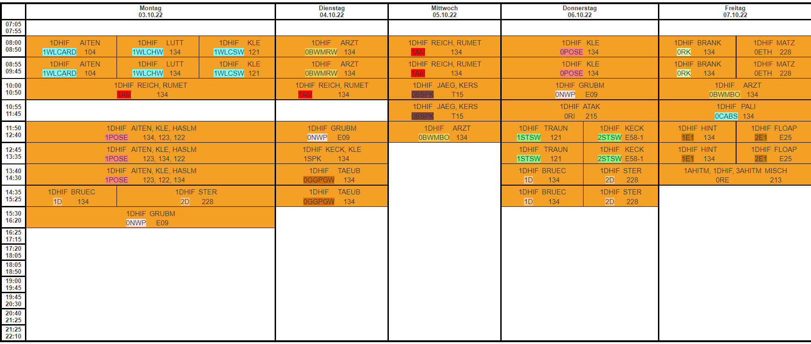

# Elternabend - 1DHIF - 2022/23

Jahrgangsvorstand: DI (FH) David Klewein, MBA (d.klewein@htl-leonding.ac.at)  
Tel: 0660 / 5031675  
Sprechstunde: tbd, Zi. 216

## Education Fileserver - Edufs

[Hier](https://edufs.edu.htl-leonding.ac.at/) finden sie unter anderem Zugang zum elektronischen Klassenbuch, dem Informationssystem LeoWiki und dem Zugang zu Moodle. Bitte verwenden sie die Zugangsdaten ihres Kindes um sich bei den Seiten anmelden zu können.  

## Vorläufiger Terminplan

[Terminplan auf LeoWiki](https://leowiki.htl-leonding.ac.at/doku.php?id=org:termine-2023)

## Tests und Schularbeiten

Tests und Schularbeiten sind in [WebUntis](https://mese.webuntis.com/WebUntis/#/basic/login) hinterlegt.  

| Art         | Name             | Datum      | Fach   |
|-------------|------------------|------------|--------|
| Test        | LZK              | 10.10.2022 | 1POSE  |
| Schularbeit | 1. Englisch-SA   | 04.11.2022 | 1E1    |
| Test        | 1. Physik - Test | 08.11.2022 | 0NWP   |
| Schularbeit | 1. Schularbeit   | 16.11.2022 | 1AM    |
| Test        | 0BWMRW           | 22.11.2022 | 0BWMRW |
| Test        | Test             | 05.12.2022 | 1POSE  |
| Schularbeit | 2D               | 15.12.2022 | 2D     |
| Test        | 0BWMBO           | 21.12.2022 | 0BWMBO |
| Test        | LZK              | 23.01.2023 | 1POSE  |
| Test        | 0BWMRW           | 24.01.2023 | 0BWMRW |
| Test        | 2. Physik - Test | 24.01.2023 | 0NWP   |
| Schularbeit | 2. Schularbeit   | 01.02.2023 | 1AM    |

## Gegenstände und Lehrkräfte

Die Gegenstände und Lehrkräfte finden sie in [Webunits dem elektronischen Klassenbuch](https://mese.webuntis.com/WebUntis/#/basic/login)

## Stundenplan

## Abwesenheiten

### Allgemeines

- Als entschuldigte Stunden gelten krankheitsbedingte Abwesenheit und Arztbesuche.
- Fehlzeiten, die durch eine Verspätung von öffentlichen Verkehrsmitteln verursacht wurden,
können als entschuldigt gewertet werden, wenn ein entsprechender Nachweis (z. B. Vorlage
eines Ausdrucks der ÖBB Homepage über Verspätung) vom Schüler bzw. der Schülerin
vorgelegt wird.
- Verspätungen der ÖBB: Auf Wunsch erhalten Sie eine Bestätigung der Verspätung entweder
vom Zugpersonal des verspäteten Zuges oder bis zum Folgetag später im Internet unter
http://fahrplan.oebb.at/bin/trainsearch.exe/dn?. Einfach den verspäteten Zug abfragen und Bestätigung
ausdrucken. Sie können diese auch per E-Mail unter kundenservice@pv.oebb.at elektronisch anfordern.
- Vorhersehbare Abwesenheiten müssen im Vorhinein mit dem Klassenvorstand abgestimmt
werden.
- Dauerausnahmen wegen schlechter öffentlicher Verkehrsanbindung sind mit dem KV
abzustimmen.

### Prozedere

- Am ersten Tag der Abwesenheit bitte vor 8:00 Uhr im Sekretariat anrufen oder in [WebUntis](https://mese.webuntis.com/WebUntis/#/basic/login) eintragen.
- Vorlage der Entschuldigungen ist eine zeitnahe Bringschuld des/der Schüler/in. Innerhalb von
einer Woche nach der Rückkehr in die Schule müssen die Abwesenheitszeiten in die Entschuldigungsliste eingetragen, von den Eltern unterschrieben und dem KV vorgelegt werden.

### Unentschuldigte Fehlstunden und Verhaltensnote

#### Sehr Zufriedenstellend (SZ)
Das ist die Norm. Andere Stufen stellen Abweichungen dar.

#### Zufriedenstellend

- Zweimaliges unentschuldigtes Fernbleiben vom Unterricht, Exkursionen, Lehrausgängen, Schulveranstaltungen.... (Eintragung in WebUntis). Die Dauer des unentschuldigten Fernbleibens ist hier unerheblich.
  
- Zwei Mal in den Unterricht zu spät kommen, beim Läuten nicht in der Klasse sein (Eintragung in WebUntis). Ausgenommen sind Verspätungen, die nachweislich durch Verspätung öffentlicher Verkehrsmittel verursacht wurden.

- Beleidigungen, Beschimpfungen und Kraftausdrücke, sowie respektloser Umgangston mit MitschülerInnen.

- Förderunterricht, Freigegenstände oder unverbindliche Übungen schwänzen.

- Unterschriften der Erziehungsberechtigten nicht vorweisen.

- Stören des Unterrichts.

- Wiederholte unerlaubte Handynutzung.

- Sich bei Verstößen nicht entschuldigen.

- Rauchen am Schulgelände.

- Verstöße gegen die Schul-/Hausordnung.

#### Wenig Zufriedenstellend

- Viermaliges unentschuldigtes Fernbleiben vom Unterricht, Exkursionen, Lehrausgängen, Schulveranstaltungen,... (Eintragung in WebUntis). Die Dauer des unentschuldigten Fernbleibens ist hier unerheblich.

- Vier Mal in den Unterricht zu spät kommen, beim Läuten nicht in der Klasse sein (Eintragung in WebUntis). Ausgenommen sind Verspätungen, die nachweislich durch Verspätung öffentlicher Verkehrsmittel verursacht wurden.

- Dauerstörer im Unterricht.

- Wiederholte Beleidigungen, Beschimpfungen und Kraftausdrücke, sowie respektloser Umgangston mit MitschülerInnen.

- Aggressiver, provokanter oder sonstiger unzumutbarer Umgangston gegenüber MitschülerInnen, Lehrkräften oder dem Personal (anschreien, anpöbeln, frozzeln, nachäffen, Unhöflichkeiten,...).

- Erschwindeln von Leistungen.

- Fälschen von Unterschriften der Eltern bzw. Erziehungsberechtigten.

- Wiederholt schwerwiegende Verstöße gegen die Schul-/Hausordnung.

#### Nicht Zufriedenstellend

- Sechsmaliges unentschuldigtes Fernbleiben vom Unterricht, Exkursionen, Lehrausgängen, Schulveranstaltungen,... (Eintragung in WebUntis). Die Dauer des unentschuldigten Fernbleibens ist hier unerheblich.

- Sechs Mal in den Unterricht zu spät kommen, beim Läuten nicht in der Klasse sein (Eintragung in WebUntis). Ausgenommen sind Verspätungen, die nachweislich durch Verspätung öffentlicher Verkehrsmittel verursacht wurden.

- Mitschüler bestehlen, bedrohen, terrorisieren.

- Strategische und geplante Beleidigungen, Beschimpfungen und Kraftausdrücke, sowie respektioser Umgangston mit anderen Personen (Mobbing, Stalking, Cybermobbing).

- Gewalttätigkeit gegenüber Mitschülern.

- Eigentumsdelikte jeglicher Art.

- Mutwilliges Zerstören, Beschmutzen,... von Eigentum der Mitschüler oder Schule.

- Ausübung von körperlicher Gewalt, wie Rangeleien, Raufereien, etc.

- Vorsätzliches Erschwindeln von Leistungen.

- Fälschen von Unterschriften der Eltern bzw. Erziehungsberechtigten auf Dokumenten.

- Besonders schwerwiegende Verstöße gegen die unter "Wenig Zufriedenstellend" genannten Regeln.

#### Geplante Abwesenheiten

(Schnuppertage, Sportveranstaltungen etc.) sind im vorhinein zu genehmigen:
Fernbleiben bis zu einem Tag: KV
Fernbleiben bis zu einer Woche: Schulleiter
Sonst: Landesschulrat

## Schule und Unterricht

- Bitte nutzen Sie die Sprechstunden. Ab Mitte Oktober sind die aktuellen Sprechstundenzeiten
auf der Homepage der HTL Leonding ersichtlich.
- Schüler/innen werden viel Zeit vor dem Computer verbringen. Seien Sie wachsam, ob auch
wirklich für die Schule gearbeitet wird!
- Wir versuchen unsere Schüler/innen langsam an eine gewisse Selbständigkeit heranzuführen.
Übungen zur Terminverwaltung und Selbstorganisation werden u.a. im Fach SOPK mit den Schüler/innen angegangen.
- Planung und längerfristiges Lernen: Besprechen Sie bitte mit Ihrem Kind, dass der
Terminkalender in den Monaten November und Jänner ziemlich voll sein wird und ein
ständiges Mitlernen unabdingbar ist.
- Jahreszeugnis darf maximal drei Nicht Genügend beinhalten, um den ersten Jahrgang
wiederholen zu dürfen.
- “Nebenfächer” gibt es bei uns nicht mehr wirklich. Nicht Genügend in den Fächern Physik,
Chemie, TI, WLC etc. sind nicht auszuschließen.
- Für den Fall der Fälle: Nachhilfebörse rechtzeitig nutzen. Oft genügen kleine Impulse!
- Mobiltelefone müssen im Unterricht ausgeschaltet sein.

## Umgangsformen

- Lehrer/innen sind bemüht mit den Eltern zum Wohle der Schüler/innen zusammenarbeiten.
Bleiben Sie bitte mit uns in Kontakt. Wenn Ihnen etwas auffällt, Sie sich ärgern oder auch freuen: Bitte kontaktieren Sie uns.
- Wir versuchen möglichst viel zu loben und positiv zu motivieren. Unterstützen Sie uns.
- Pünktlichkeit: 5 Minuten vor Unterrichtsbeginn in der Klasse.
- Rauchverbot in der Schule.
- Rauchverbot für alle Schüler/innen der ersten Jahrgänge.
- Höflichkeit und wertschätzender Umgang.
- Ordnung in der Klasse.
- Positives Lernklima und Klassengemeinschaft.

## Ferialpraxis

- Mind. 2 x 4 Wochen
- Ab dritten Jahrgang - Tbd??
- Voraussetzung für Matura!
- Nachweis der Praxiszeiten:
Vor Dienstantritt Formular im Sekretariat abholen
- Tätigkeitsprotokoll führen
- Am Ende Bestätigung der Firma einholen
- Bestätigung der Anrechenbarkeit des Praktikums beim KV einholen
- Freistellungen in der letzten Schulwoche auf Antrag möglich

## Wahl der Elternvertreter

- Freiwillige willkommen! :-)
